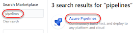
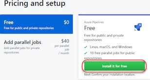
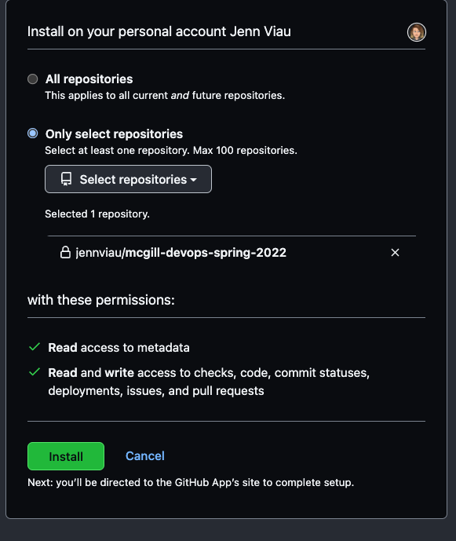
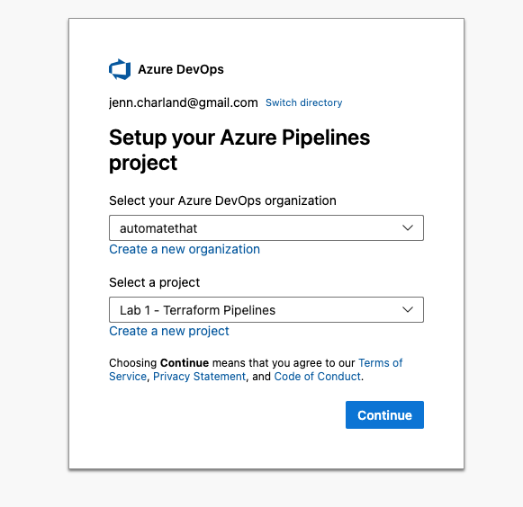

# DevOps Concepts for Leaders - McGill

## Purpose

## Lab Exercise 1: Configuring Cloud Deployments with Terraform

In this exercise, you will practice using the core components of terraform including providers, modules and resources to create and manage the lifecycle of cloud based resources.

### Exercise objectives

Create a multi-stage Azure DevOps Pipeline to deploy Azure-based resources that include integration and compliance testing of IaC objects as well as a manual approval stage prior to resource deployment

### Getting Started

This set of exercises uses GitHub, the Azure Portal and Azure DevOps Pipelines. 

- [ ] Create a GitHub account if you do not already have one by following the instructions found on the [GitHub Signup Page](https://github.com/signup)
    - [ ] Use this repository as the starting point for your labs by creating a Fork. 
        
        

    > **Note:** If your github is a member of an organization, ensure your Fork is created under your personal GitHub account

- [ ] Create a new Azure Portal Account by following the instructions found on the [Azure Signup Page](https://azure.microsoft.com/en-ca/free/)
    
    > **Note:** Use a personal email address, not one that is associated with an existing Azure account    

- [ ] Create a new Azure DevOps Organization from the [Services page of the Azure Portal](https://portal.azure.com/#allservices/category/DevOps)
    - [ ] Create a new project in your Azure DevOps Organization. This will be used for both Lab 1 and Lab 2.
        

- [ ] Connect your GitHub repositories to your Azure DevOps project
    - [ ] Install  `Azure Pipelines` from the GitHub Marketplace
        - Navigate to the GitHub Marketplace

        
        
        - Search for “pipelines” and click Azure Pipelines
        
        
        
        - Scroll to the bottom and click Install it for free
        
        
        
        - Configure Azure Pipelines access to your forked repository
        
        

        - You will be redirected to the Azure Pipelines site to finish the connections. 
        Ensure that the Azure DevOps organization, and Projects match what you created earlier
        
    
- [ ] Continue on to [Lab 1 - Creating Terraform Resources](lab-1-terraform-resources/README.MD)

