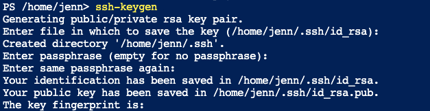
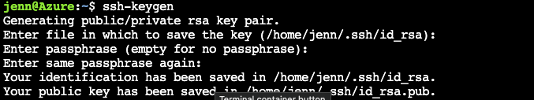

# Creating and Managing Cloud Resources with Terraform

In this exercise, you will practice using the core components of terraform including providers, modules and resources to create and manage the lifecycle of cloud based resources.


## Exercise objectives

Create a multi-stage GitHub Action to deploy Azure-based resources that include integration and compliance testing of IaC objects as well as a manual approval stage prior to resource deployment

## Environment Setup

All steps in this lab exercise should be completed using the Azure Cloud Shell environment. All required tools including the Azure CLI, HashiCorp Terraform and the git CLI come pre-installed in this Cloud Shell Environment

- [ ] Login to the [Azure Portal](https://portal.azure.com/) with the login information you created

    - [ ] Launch Azure Cloud Shell from the top navigation panel
        
        

        Select your "Free Trial" Subscription to create a storage account for your Cloud Shell and click "Create Storage"

        You will have the option of using a PowerShell or a Bash (Linux) environment to run all subsequent sections of the lab. Select the environment you're most comfortable with.

- [ ] Create an Azure Service Principal to use with GitHub and Terraform
        az ad sp create-for-rbac --role="Contributor" --scopes="/subscriptions/${SUBSCRIPTION_ID}"
- [ ]         
- [ ] Create an SSH Key to securely access your GitHub Repos:
    PowerShell:

    
    
    Bash: 

    

    **Do not enter a passphrase when prompted, simply hit return twice**  
    
    Add your [SSH Public Key to your GitHub Repository](https://github.com/settings/keys) by selecting "New SSH Key" and entering the contents of the `id_rsa.pub` file found in the `.ssh` directory of your Cloud Shell environment
    
    You can retrieve the contents of the public key in both PowerShell and Bash with : 

        cat .ssh/id_rsa.pub

- [ ] Clone your GitHub repository to your Cloud Shell environment:

    ```git clone git@github.com:<USERNAME>/mcgill-devops-spring-2022```
     > **Hint:** You can get your GitHub repository URL from the CODE button drop down on the repository main page


# Creating GitHub Action Workflows for Terraform 

In this lab we will be using Terraform and Github Actions to create Azure resources. GitHub Actions is a continuous integration and continuous delivery (CI/CD) platform that allows you to automate your build, test, and deployment pipeline. You can create workflows that build and test every pull request to your repository, or deploy merged pull requests to production.

We will define 2 types of GitHub Actions, that will check for Security Compliance against standardized baselines using [Checkov](https://www.checkov.io/) and for custom Code Compliance standards with [Terraform Compliance](https://terraform-compliance.com/)

We will also use the HashiCorp Terraform Github Actions plugins to deploy Azure resources if our Security and Code compliance checks pass

## Preparing Azure resources for Terraform

Terraform must store state about your managed infrastructure and configuration. This state is used by Terraform to map real world resources to your configuration, keep track of metadata, and to improve performance for large infrastructures.

Terraform best practices recommend using remote state, or storing your terraform state information in a remote location instead of in a local file. 

This is configured by creating a `backend` definition in your terraform manifests. Backends are initialized before any other part of terraform, and cannot contain variables.

Create a resource group in Azure, using the `az` CLI to hold your terraform remote state:

```shell
az group create -n github-actions-tfstate -l eastus2
```

Additionally, because state files can contain sensitive information, access to it should be tightly controlled. Create an Azure Storage Account and Storage Account Container to host your terraform state file:


```shell

# Create Storage Account
az storage account create -n github-actions-tfstate -g github-actions-tfstate -l eastus2 --sku Standard_LRS
 
# Create Storage Account Container
az storage container create -n tfstatedevops 
```

In order to create resources programatically, Terraform must authenticate to Azure. Best practices for Terraform indicate that authentication should be done via Service Principal, instead of User accounts.

Create a service principal that will be used by Terraform to authenticate to Azure (Note down password)

```shell
az ad sp create-for-rbac --role="Contributor" --scopes="/subscriptions/${SUBSCRIPTION_ID}"
```
>**Note:** Make a note of the credential information that is provided after running this step, it is needed in subsequent stages

## Adding Azure Connection information to Github

In order for our Terraform GitHub actions to create resources in Azure, we must configure connection information as secrets in GitHub.


In the "Settings" page of your GitHub repository, select the "Secrets" section and create four new Repository Secrets for the following required secrets:


| Name | Value|
|:-|:-|
|`AZURE_AD_CLIENT_ID`| The Service principal ID from above|
|`AZURE_AD_CLIENT_SECRET`| The secret that was created as part of the Azure Service Principal|
|`AZURE_AD_TENANT_ID`| The Azure AD tenant ID to where the service principal was created|
|`AZURE_SUBSCRIPTION_ID`| Subscription ID of where you want to deploy the Terraform|


## Creating your GitHub Workflows

From Azure Cloud Shell, in the `lab-1-terraform-resources/workflows` directory of the repository you cloned there is an Action definition files. In order to integrate them into your repository, create a new directory `.github/workflows` and copy the files to it

```shell
cd ~/mcgill-devops-spring-2022
mkdir -p .github/workflows
```

```shell
cd lab-1-terraform-resources/workflows
cp *.yml ~/mcgill-devops-spring-2022/.github/workflows
```

Configure your git client

```shell

  git config --global user.email "you@example.com"
  git config --global user.name "Your Name"
```
**Note:** Replace "you@example.com" with the email address associated with your Github Account, and "Your Name" with your name

Commit your new changes to the Github Repository:

```
git add /home/jenn/mcgill-devops-spring-2022/.github/workflows/*
git commit -m "Adding GitHub Actions Workflow for Compliance and Security"
git push -u origin main
```

Inspect your new Github Actions in the Github web UI

## Creating Azure Resources

Now that your repository is setup to for Static Code analysis and Compliance checks, test out the Actions workflow by updating the `backend.tf` file in the `resource-group` directory:

Update the following key-value pairs, with the Azure Resource group, Storage account and Storage Account container values you created in the previous steps: 

```shell
    resource_group_name  = "github-actions-tfstate"
    storage_account_name = "githubactionstfstate"
    container_name       = "tfstatedevops"
    key                  = "resourcegroup.tfstate"
```

Commit your changes to GitHub!

```
git add lab-1-terraform-resources/terraform/resource-group/backend.tf
git commit -m "Configuring Terraform backend for Azure Resource Group"
git push -u origin main
```

Inspect the stages of your CI pipeline, what errors do you see?

## Correcting Validation Errors

Add in the required tags to your Azure Resource Group manifest in `main.tf`


```
resource "azurerm_resource_group" "rg" {
  name     = "rg-devops-tf-${random_uuid.uuid.result}"
  location = var.location

  tags = {
    environment = "dev"
  }
}
```

```
git add lab-1-terraform-resources/terraform/resource-group/main.tf
git commit -m "Adding Environment Tag for Compliance Checks"
git push -u origin main
```

Inspect your Github Actions CI workflow, review the different stages and the information provided by the workflows. What do you notice?

Inspect the resources available in your [Azure portal](https://portal.azure.com/#blade/HubsExtension/BrowseResourceGroups) - do you have a new Resource Group? What else was created?