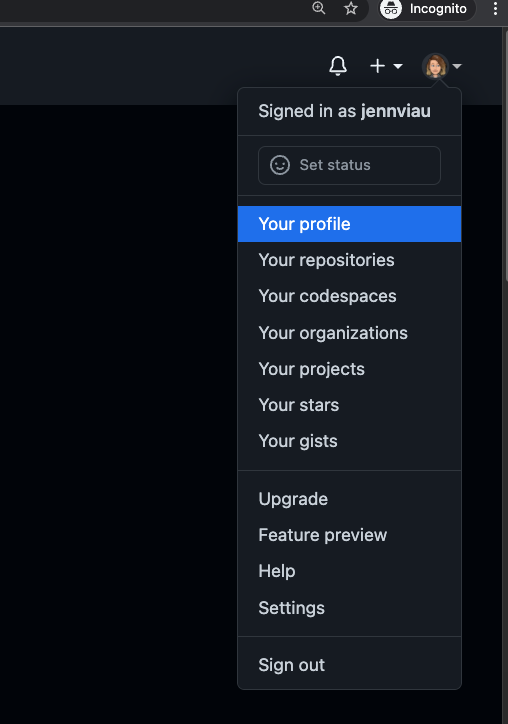
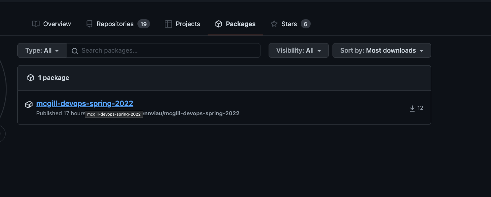
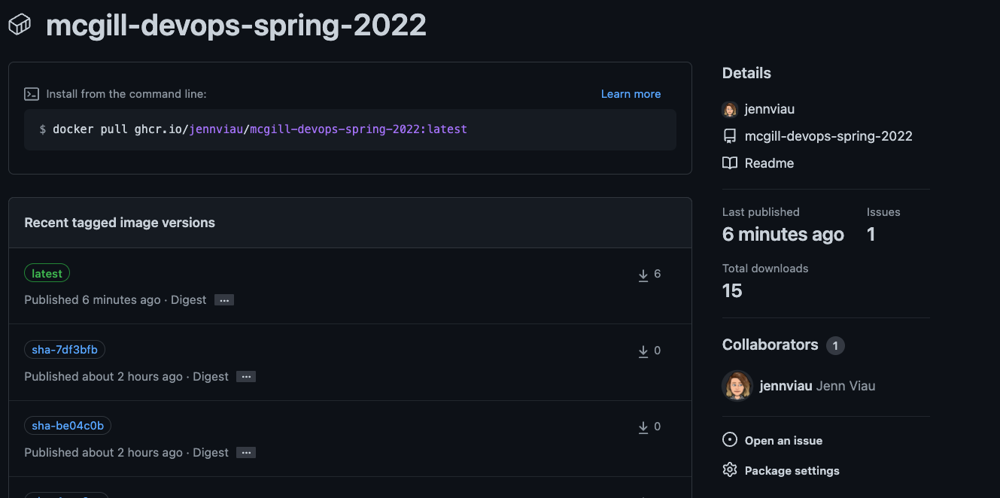

# Creating and Managing Kubernetes Deployments

In this exercise, you will practice creating and deploying a web-based application to Azure Kubernetes Service(AKS)


## Exercise objectives

* Create a multi-stage GitHub Action to deploy AKS resources that include integration and compliance testing of IaC objects.
* Create a multi-stage Github Action to build and deploy a containerized web-based application to your AKS Cluster

## Tools Used

- [Docker]
- [Checkov](https://www.checkov.io/) - Static Code Analysis
- [Terraform Compliance](https://terraform-compliance.com/) - security and compliance focused test framework
- [GitHub Actions](https://github.com/features/actions) - Continuous Integration and Continuous Delivery
- [GitHub Container Registry](https://docs.github.com/en/packages/working-with-a-github-packages-registry/working-with-the-container-registry)
- [Helm](https://helm.sh/)
- [Azure Portal](https://portal.azure.com/) - Cloud Infrastructure


## Environment Setup

All steps in this lab exercise should be completed using the Azure Cloud Shell environment. All required tools including the Azure CLI, HashiCorp Terraform and the git CLI come pre-installed in this Cloud Shell Environment

- [ ] Login to the [Azure Portal](https://portal.azure.com/) with the login information you created in the previous lab

    - [ ] Launch Azure Cloud Shell from the top navigation panel
        
        

        You will have the option of using a PowerShell or a Bash (Linux) environment to run all subsequent sections of the lab. Select the environment you're most comfortable with.
## Syncing Changes

In order to get all the new labs and workflow files, you will need to incorporate the changes made in the upstream repository:

```shell
cd ~/mcgill-devops-spring-2022
git remote add upstream git@github.com:jennviau/mcgill-devops-spring-2022.git
git fetch upstream
git pull upstream main
git push origin
```

# Creating GitHub Action Workflows for Terraform and Kubernetes Resources

In this lab we will be using Terraform and Github Actions to create Azure resources. GitHub Actions is a continuous integration and continuous delivery (CI/CD) platform that allows you to automate your build, test, and deployment pipeline. You can create workflows that build and test every pull request to your repository, or deploy merged pull requests to production.

We will define 2 types of GitHub Actions, one that will build our Azure Kubernetes Service Cluster, and one that will build and deploy a containerized application to our cluster.

## Adding Azure Connection information to Github

In order to deploy to AKS with GitHub actions we must configure kubernentes connection information as secrets in GitHub.


Start by creating a new Service Principal:

```shell
#Getting Your Subscription Information

#BASH
export SUBSCRIPTION_ID=$(az account show --query id --output tsv)
az ad sp create-for-rbac --name "AKS" --role contributor \
--scopes /subscriptions/${SUBSCRIPTION_ID} \
--sdk-auth


#PowerShell
$env:SUBSCRIPTION_ID=(az account show --query id --output tsv
az ad sp create-for-rbac --name "AKS" --role contributor \
--scopes="/subscriptions/$env:SUBSCRIPTION_ID" \
--sdk-auth
```

In the "Settings" page of your GitHub repository, select the "Secrets" section and create a new Repository Secret for the following required secret:


| Name | Value|
|:-|:-|
|`AZURE_CREDENTIALS`| The full output of the previous command|


## Creating your GitHub Workflows

In the `lab-2-kubernetes-resources/workflows` directory of the repository you cloned there is are 2 GitHub Action definition files. 

The first GitHub action we will run will create a new AKS environment.

Using Azure Cloud Shell, copy the `lab-2-aks-actions.yml` file to your existing `.github/workflows` directory:

```shell
cd ~/mcgill-devops-spring-2022
```

```shell
cp lab-2-kubernetes-resources/workflows/lab-2-aks-actions.yml ~/mcgill-devops-spring-2022/.github/workflows
```

Commit your new changes to the Github Repository:

```
git add ~/mcgill-devops-spring-2022/.github/workflows/*
git commit -m "Adding AKS GitHub Actions Workflow for Lab 2"
git push -u origin main
```

## Creating AKS Resources

Now that your repository is setup to deploy an AKS Cluster, including Static Code analysis and Compliance checks, test out the Actions workflow by updating the `backend.tf` file in the `lab-2-kubernetes-resources/terraform/aks-cluster/aks-cluster` directory:

Update the following key-value pairs, with the Azure Resource group, Storage account and Storage Account container values you created in the previous steps: 

```shell
    resource_group_name  = "github-actions-tfstate"
    storage_account_name = ""  ## Use the Storage Account name you set in the previous lab
    container_name       = "tfstatedevops"
    key                  = "lab-2-aks-cluster.tfstate"
```
>**Hint:** You can open an Editor window from Shell by clicking the `{}` button at the top of your cloud shell window


Commit your changes to GitHub!

```
git add lab-2-kubernetes-resources/terraform/aks-cluster/backend.tf
git commit -m "Configuring Terraform backend for Azure Resource Group"
git push -u origin main
```

Inspect your Github Actions CI workflow, review the different stages and the information provided by the workflows. What do you notice?

Inspect the resources available in your [Azure portal](https://portal.azure.com/#blade/HubsExtension/BrowseResourceGroups) - do you have a new AKS Cluster? 


## Deploying Containerized Applications 

Now that you have a Kubernetes environment, you can deploy a new web-based application to it.

In the `lab-2-kubernetes-resources` folder, there are two additional folders, one for the containerized application and one for the deployment configuration information.
To deploy these resources, we will need to create a new GitHub actions workflow:

## Create a New CI Pipeline

Once your AKS cluster creation is complete, inspect the output of the GitHub action - there will be 2 outputs, for the cluster name and the cluster resource group.

Update the `lab-2-kubernetes-resources/workflows/docker-build-actions.yml` file by populating the following fields with the kubernetes cluster name and resource group information:

```yaml
env:
  RESOURCE_GROUP: 
  CLUSTER_NAME: 
```

Copy the updated `lab-2-kubernetes-resources/workflows/docker-build-actions.yml` workflow file to your `.github/workflows` directory:


```shell
cd ~/mcgill-devops-spring-2022
cp lab-2-kubernetes-resources/workflows/docker-build-actions.yml ~/mcgill-devops-spring-2022/.github/workflows
```

Commit your  changes to the Github Repository:

```
git add ~/mcgill-devops-spring-2022/.github/workflows/*
git commit -m "Adding GitHub Actions Workflow to deploy Azure Voting Application"
git push -u origin main
```


## Deploy a Containerized Application

Now that we have a workflow to build and deploy our application, we can customize our voting application and deploy it.

Inspect the `values.yaml` file in the `lab-2-kubernetes-resources/helm-charts/azure-vote` folder. Update the values for `voteOption1` and `voteOption2` to items of your choice.

Commit your changes and inspect the GitHub Action:

```
git add ~/mcgill-devops-spring-2022/lab-2-kubernetes-resources/helm-charts/azure-vote/values.yaml
git commit -m "Adding Voting options for Azure Vote Application"
git push -u origin main
```

Once your pipeline has completed, navigate to your [AKS Cluster in the Azure Portal](https://portal.azure.com/#blade/HubsExtension/BrowseResource/resourceType/Microsoft.ContainerService%2FmanagedClusters)

  ***Note***
  Since we are using the Github Container Registry to host our container images you may have to change the visibility settings of your Container registry.
  Navigate to your Github Profile page:

  

  From your profile page, select the packages tab:

  

  If your packages repository has a label of private, select it, and go to the settings section:

  

  Scroll to the bottom of the settings section and select `Change Visibility` to make it public


Select the "Service and Ingress" for your cluster. What do you see?

**Hint** There should be a section that says `External IP`

Navigate to your Voting application, and inspect your application!


## Cleaning Up

Once you are satisfied with your environments and finished exploring, you can clean up all the created resources by modifying the github Actions workflow to add a new step:

Add the code snippet below to the bottom of the `lab-2-aks-actions.yml` in your `.github/workflows` directory

```yaml
  terraform-destroy:
      name: Terraform Resource removal
      needs: terraform-apply
      runs-on: ubuntu-latest
      defaults:
        run:
          working-directory: lab-1-terraform-resources/terraform/aks-cluster
      env:
        ARM_CLIENT_ID: ${{ secrets.AZURE_AD_CLIENT_ID }}
        ARM_CLIENT_SECRET: ${{ secrets.AZURE_AD_CLIENT_SECRET }}
        ARM_SUBSCRIPTION_ID: ${{ secrets.AZURE_SUBSCRIPTION_ID }}
        ARM_TENANT_ID: ${{ secrets.AZURE_AD_TENANT_ID }}
      steps:
        - name: 'Checkout'
          uses: actions/checkout@master
        - uses: hashicorp/setup-terraform@v1
        # Check for formatting
        - name: Initializing Terraform
          id: init
          run:  terraform init
        - name: Validating Plan 
          id: plan
          run:  terraform plan
        - name: Destroying  Resources  
          id: apply
          run:  terraform apply -destroy -auto-approve
```

Commit your new changes to the Github Repository:

```
git add ~/mcgill-devops-spring-2022/.github/workflows/*
git commit -m "Adding Terraform Destroy stage to GitHub Actions Workflow for AKS Cluster Compliance and Security"
git push -u origin main
```

Modify any of your `aks-cluster` terraform files to add a new line ( this will trigger the workflow) and commit the changes.

>**Hint** Use `git status` to see the full name and path of the files you changed for your `git add` and `git commit` commands
