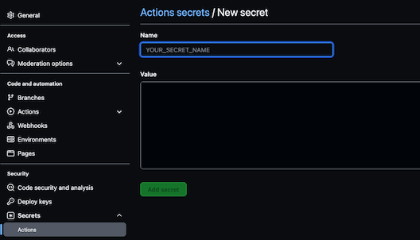
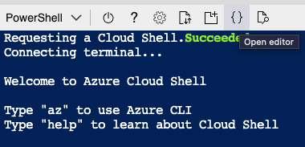

# Creating and Managing Kubernetes Deployments

In this exercise, you will practice creating and deploying a web-based application to Azure Kubernetes Service(AKS)


## Exercise objectives

Create a multi-stage GitHub Action to deploy AKS resources that include integration and compliance testing of IaC objects.
Create a multi-stage Github Action to build and deploy a containerized web-based application to your AKS Cluster

## Tools Used

- [Docker]
- [Checkov](https://www.checkov.io/) - Static Code Analysis
- [Terraform Compliance](https://terraform-compliance.com/) - security and compliance focused test framework
- [GitHub Actions](https://github.com/features/actions) - Continuous Integration and Continuous Delivery
- [GitHub Container Registry]
- [Helm]
- [Azure Portal](https://portal.azure.com/) - Cloud Infrastructure


## Environment Setup

All steps in this lab exercise should be completed using the Azure Cloud Shell environment. All required tools including the Azure CLI, HashiCorp Terraform and the git CLI come pre-installed in this Cloud Shell Environment

- [ ] Login to the [Azure Portal](https://portal.azure.com/) with the login information you created

    - [ ] Launch Azure Cloud Shell from the top navigation panel
        
        

        You will have the option of using a PowerShell or a Bash (Linux) environment to run all subsequent sections of the lab. Select the environment you're most comfortable with.

- [ ] 
       
# Creating GitHub Action Workflows for Terraform 

In this lab we will be using Terraform and Github Actions to create Azure resources. GitHub Actions is a continuous integration and continuous delivery (CI/CD) platform that allows you to automate your build, test, and deployment pipeline. You can create workflows that build and test every pull request to your repository, or deploy merged pull requests to production.

We will define 2 types of GitHub Actions, that will check for Security Compliance against standardized baselines using [Checkov](https://www.checkov.io/) and for custom Code Compliance standards with [Terraform Compliance](https://terraform-compliance.com/) 

We will also use the HashiCorp Terraform Github Actions plugins to deploy Azure resources if our Security and Code compliance checks pass

## Preparing Azure resources for Terraform

In order to create resources programatically, Terraform must authenticate to Azure. Best practices for Terraform indicate that authentication should be done via Service Principal, instead of User accounts.

Create a service principal that will be used by Terraform to authenticate to Azure (Note down password)

```shell
#Getting Your Subscription Information
#BASH
export SUBSCRIPTION_ID=$(az account show --query id --output tsv)

az ad sp create-for-rbac --role="Contributor" --scopes="/subscriptions/${SUBSCRIPTION_ID}"
#PowerShell
$env:SUBSCRIPTION_ID=(az account show --query id --output tsv
az ad sp create-for-rbac --role="Contributor" --scopes="/subscriptions/$env:SUBSCRIPTION_ID"
```
>**Note:** Make a note of the credential information that is provided after running this step, it is needed in subsequent stages

## Adding Azure Connection information to Github

In order for our Terraform GitHub actions to create resources in Azure, we must configure connection information as secrets in GitHub.




In the "Settings" page of your GitHub repository, select the "Secrets" section and create a new Repository Secret for the following required secret:


| Name | Value|
|:-|:-|
|`AZURE_CREDENTIALS`| The AppID information from the Service principal ID from above|


## Creating your GitHub Workflows

From Azure Cloud Shell, in the `lab-2-terraform-resources/workflows` directory of the repository you cloned there is are 2 GitHub Action definition files. In order to integrate them into your repository, copy the files to your existing `.github/workflows/` directory

```shell
cd ~/mcgill-devops-spring-2022
```

```shell
cp lab-2-kubernetes-resources/workflows/resource-group-actions.yml ~/mcgill-devops-spring-2022/.github/workflows
```

Commit your new changes to the Github Repository:

```
git add ~/mcgill-devops-spring-2022/.github/workflows/*
git commit -m "Adding GitHub Actions Workflow for "
git push -u origin main
```

## Creating Azure Resources

Now that your repository is setup to for Static Code analysis and Compliance checks, test out the Actions workflow by updating the `backend.tf` file in the `resource-group` directory:

Update the following key-value pairs, with the Azure Resource group, Storage account and Storage Account container values you created in the previous steps: 

```shell
    resource_group_name  = "github-actions-tfstate"
    storage_account_name = ""  ## Use the Storage Account name you set above
    container_name       = "tfstatedevops"
    key                  = "resourcegroup.tfstate"
```
>**Hint:** You can open an Editor window from Shell by clicking the `{}` button at the top of your cloud shell window




Commit your changes to GitHub!

```
git add lab-1-terraform-resources/terraform/resource-group/backend.tf
git commit -m "Configuring Terraform backend for Azure Resource Group"
git push -u origin main
```

Inspect the stages of your CI pipeline, what errors do you see?


Inspect your Github Actions CI workflow, review the different stages and the information provided by the workflows. What do you notice?

Inspect the resources available in your [Azure portal](https://portal.azure.com/#blade/HubsExtension/BrowseResourceGroups) - do you have a new Resource Group? What else was created?


## More Resource Creation

Create an Azure Kubernetes Cluster using your GitHub actions CI Pipeline

## Create a New CI Pipeline

Copy the `aks-actions.yml` workflow file to your `.github/workflows` directory:


```shell
cd lab-1-terraform-resources/workflows
cp aks-actions.yml ~/mcgill-devops-spring-2022/.github/workflows
cd ~/mcgill-devops-spring-2022
```

Commit your new changes to the Github Repository:

```
git add ~/mcgill-devops-spring-2022/.github/workflows/*
git commit -m "Adding GitHub Actions Workflow for AKS Cluster Compliance and Security"
git push -u origin main
```

Inspect your new Github Actions in the Github web UI

## Creating Azure Kubernetes Service Resource


Now that your repository is setup to perform Static Code analysis and Compliance checks, test out the new  Actions workflow by updating the `backend.tf` file in the `aks-cluster` directory:

Update the following key-value pairs, with the Azure Resource group, Storage account and Storage Account container values you created previously: 

```shell
    resource_group_name  = "github-actions-tfstate"
    storage_account_name = ""  ## Use the Storage Account name you set above
    container_name       = "tfstatedevops"
    key                  = "akscluster.tfstate"
```

Commit your changes to GitHub!

```
git add lab-1-terraform-resources/terraform/aks-cluster/backend.tf
git commit -m "Configuring Terraform backend for Azure Kubernetes Service"
git push -u origin main
```

Inspect the stages of your CI pipeline, what errors do you see?

## Correcting Validation Errors

Correct the value for the required tags to your AKS Cluster manifest in `main.tf`

>**Hint** The list of accepted values will be displayed in the GitHub actions output.

```
git add lab-1-terraform-resources/terraform/aks-cluster/main.tf
git commit -m "Adding Environment Tag for Compliance Checks"
git push -u origin main
```

Inspect your Github Actions CI workflow, review the different stages and the information provided by the workflows. What do you notice?


## Cleaning Up

Once you are satisfied with your environments and finished exploring, you can clean up all the created resources by modifying the github Actions workflow to add a new step:

Add the code snippet below to the bottom of the `aks-actions.yml` in your `.github/workflows` directory

```yaml
  terraform-destroy:
      name: Terraform Resource removal
      needs: terraform-apply
      runs-on: ubuntu-latest
      defaults:
        run:
          working-directory: lab-1-terraform-resources/terraform/aks-cluster
      env:
        ARM_CLIENT_ID: ${{ secrets.AZURE_AD_CLIENT_ID }}
        ARM_CLIENT_SECRET: ${{ secrets.AZURE_AD_CLIENT_SECRET }}
        ARM_SUBSCRIPTION_ID: ${{ secrets.AZURE_SUBSCRIPTION_ID }}
        ARM_TENANT_ID: ${{ secrets.AZURE_AD_TENANT_ID }}
      steps:
        - name: 'Checkout'
          uses: actions/checkout@master
        - uses: hashicorp/setup-terraform@v1
        # Check for formatting
        - name: Initializing Terraform
          id: init
          run:  terraform init
        - name: Validating Plan 
          id: plan
          run:  terraform plan
        - name: Destroying  Resources  
          id: apply
          run:  terraform apply -destroy -auto-approve
```

Commit your new changes to the Github Repository:

```
git add ~/mcgill-devops-spring-2022/.github/workflows/*
git commit -m "Adding Terraform Destroy stage to GitHub Actions Workflow for AKS Cluster Compliance and Security"
git push -u origin main
```

Modify any of your `aks-cluster` terraform files to add a new line ( this will trigger the workflow) and commit the changes.

>**Hint** Use `git status` to see the full name and path of the files you changed for your `git add` and `git commit` commands
